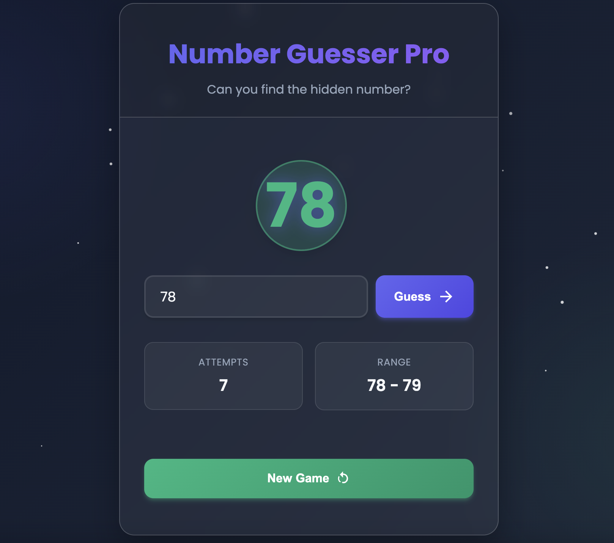

# Guess the Number Game

A modern, interactive number guessing game built with vanilla JavaScript, HTML5, and CSS3. Test your intuition and guessing skills as you try to find the hidden number within 10 attempts!



## Features

- 🎮 Simple and intuitive gameplay
- 🎨 Beautiful, responsive design
- 📱 Works on all device sizes
- 🎯 Smart number range adjustment
- 🎉 Visual feedback for each guess
- 🏆 Win/lose conditions with animations
- 🔄 New Game button to restart anytime

## How to Play

1. The game selects a random number between 1 and 100
2. Enter your guess in the input field
3. Get feedback if your guess is too high or too low
4. Find the number in 10 or fewer attempts to win!

## Installation

1. Clone the repository:
   ```bash
   git clone https://github.com/FraneCaleta/guess-the-number.git
   cd guess-the-number
   ```

2. Start a local server (choose one of the following methods):

   **Python 3 (recommended):**
   ```bash
   # For Python 3
   python3 -m http.server 8000
   ```
   Then open `http://localhost:8000` in your web browser.

   **Or using PHP (if installed):**
   ```bash
   php -S localhost:8000
   ```
   Then open `http://localhost:8000` in your web browser.

   **Or using Node.js with http-server (if installed):**
   ```bash
   npx http-server -p 8000
   ```
   Then open `http://localhost:8000` in your web browser.

   > **Note:** Using a local server is necessary for the game to work properly due to browser security restrictions when loading local files.

## Technologies Used

- HTML5
- CSS3 (with Flexbox and CSS Variables)
- JavaScript (ES6+)
- GSAP for animations
- Google Fonts (Poppins)

## Browser Support

The game works on all modern browsers including:

- Chrome
- Firefox
- Safari
- Edge

## License

This project is open source and available under the [MIT License](LICENSE).

## Contributing

Contributions are welcome! Please feel free to submit a Pull Request.

## Author

[FraneCaleta](https://github.com/FraneCaleta)

## Acknowledgments

- Inspired by classic number guessing games
- Built with ❤️ using vanilla web technologies
